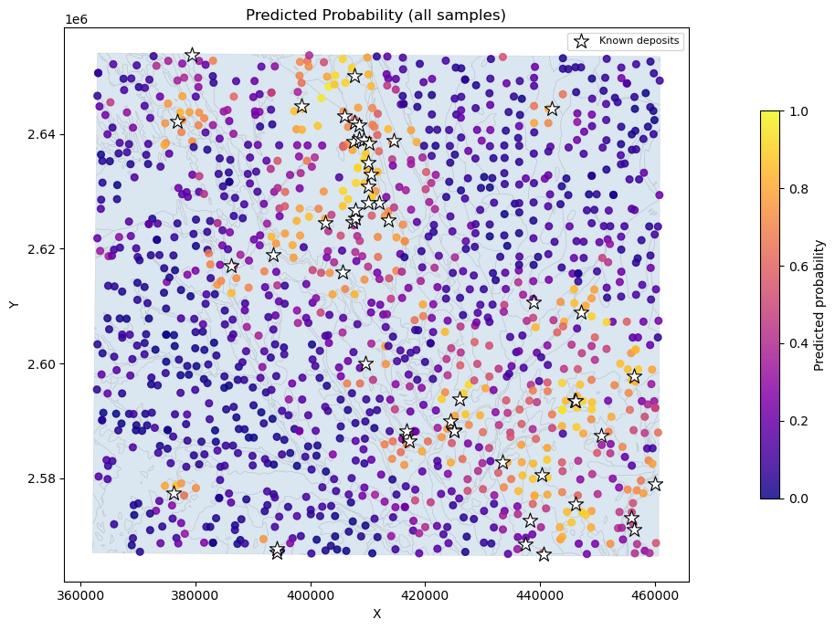

# Machine Learning for Geologists



Course material covering applied machine learning techniques for mineral exploration, using real geochemical, geophysical, and remote sensing datasets.

## Notebook

**`ML_for_geologists.ipynb`** — The main notebook, structured in sections:

| Section | Topic |
|---------|-------|
| 1 | Setup — imports, filepaths, data loading |
| 2 | Exploratory data analysis |
| 3 | Unsupervised learning — PCA and K-means clustering |
| 4 | Supervised learning — Random Forest classification |
| 5 | Model evaluation and feature importance |
| 6 | Spatial prediction mapping |

## Data

```
data/
├── vector/
│   ├── geochem.geojson          # Geochemical sample points (1,243 samples, 57 elements)
│   ├── lithology.geojson        # Lithological polygon map
│   └── mineral occurrences.geojson  # Known mineral deposit locations (52 occurrences)
├── raster/
│   ├── geophys/                 # Airborne magnetic (AMF) derivatives (RTP, 1VD, 2VD, tilt, etc.)
│   └── spectral/                # Multispectral alteration indices (clay, iron oxide, silica, etc.)
└── assets/
    └── image.png
```

## Methods Covered

- **PCA** — dimensionality reduction on multi-element geochemical data
- **K-means clustering** — unsupervised geochemical domain classification
- **Random Forest** — supervised binary classification for mineral prospectivity
- **Spatial cross-validation** — checkerboard train/test split to prevent spatial data leakage
- **Feature importance** — identifying which geochemical/geophysical features drive predictions

## Helper Module

`helpers.py` contains all supporting functions (data loading, preprocessing, spatial splitting, plotting) kept separate from the notebook to reduce clutter.
